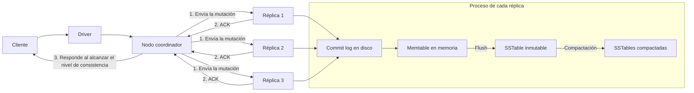
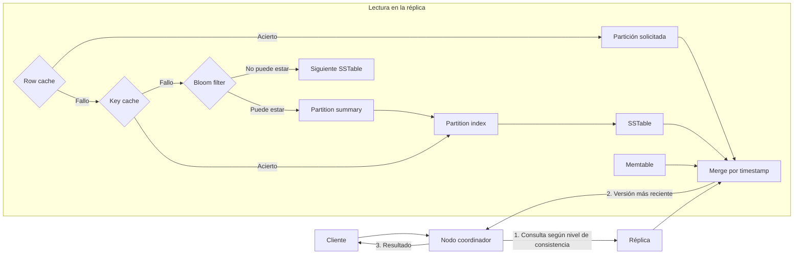

# Cassandra

## 1. Idea general

Apache Cassandra es una base de datos distribuida de tipo **wide-column** diseñada para almacenar grandes volúmenes de datos con alta disponibilidad, tolerancia a fallos y escalado horizontal. No existe un nodo maestro: todos los nodos pueden recibir peticiones y coordinar su ejecución.

Sus puntos fuertes son las escrituras rápidas, la disponibilidad y las consultas conocidas de antemano. El modelo no está pensado para hacer *joins*, agregaciones arbitrarias ni consultas ad hoc sobre cualquier columna. En Cassandra se diseña la tabla a partir de las consultas que debe servir.

Cada dato escrito tiene una marca temporal. Si se producen varias escrituras para la misma celda, prevalece la versión con el timestamp más reciente; este principio permite resolver conflictos entre réplicas.

## 2. Arquitectura del clúster

| Elemento | Función |
| --- | --- |
| Nodo | Instancia de Cassandra que almacena datos y atiende peticiones |
| Clúster | Conjunto completo de nodos |
| Data center | Agrupación lógica de nodos, normalmente por ubicación o disponibilidad |
| Rack | Agrupación de nodos dentro de un data center |
| Partición | Unidad básica de distribución y replicación de datos |
| Token | Valor calculado por el particionador que determina dónde reside una partición |

Un cliente se conecta mediante un *driver*. El driver elige un nodo disponible para cada solicitud; ese nodo actúa como **coordinador**. El coordinador localiza las réplicas responsables de la partición, les envía la operación, espera las respuestas exigidas por el nivel de consistencia y responde al cliente.

Los **nodos semilla** solo sirven para que un nodo que se incorpora conozca el clúster. No son maestros ni manejan todas las peticiones.

## 3. Particionado y nodos virtuales

El particionador aplica una función de hash a la **clave de partición** y obtiene un token. Los nodos se reparten rangos de tokens; por tanto, la clave de partición determina el nodo o nodos que almacenan una fila.

Una buena clave de partición distribuye las escrituras y lecturas de forma homogénea. Una clave con pocos valores, como un país, puede concentrar demasiados datos y tráfico en los mismos nodos (*hot partition*).

Los nodos modernos usan habitualmente **nodos virtuales** (*vnodes*): cada nodo posee varios rangos de tokens no contiguos. Esto facilita equilibrar datos y redistribuirlos cuando un nodo se añade (*bootstrap*) o se retira (*decommission*).

La partición no debe crecer sin límite. Si un valor puede acumular millones de filas —por ejemplo, todos los eventos de un usuario— se suele añadir un *bucket* temporal a la clave de partición, como `dia` o `mes`.

```text
Mala partición:    eventos por usuario             -> (usuario_id)
Partición acotada: eventos por usuario y día       -> (usuario_id, fecha)
```

## 4. Replicación y consistencia

Cada *keyspace* define un **factor de replicación** (RF): número de nodos que guardan cada partición. Todas son réplicas equivalentes; Cassandra no distingue una copia principal de las demás.

Estrategias de replicación:

- `SimpleStrategy`: coloca réplicas consecutivas en el anillo. Solo es apropiada para pruebas con un único data center.
- `NetworkTopologyStrategy`: define el RF por data center y reparte réplicas teniendo en cuenta los racks. Es la estrategia adecuada para producción.

El **nivel de consistencia** determina cuántas réplicas deben confirmar una lectura o escritura para que el coordinador responda.

| Nivel | Significado |
| --- | --- |
| `ONE`, `TWO`, `THREE` | Respuesta de una, dos o tres réplicas |
| `QUORUM` | Mayoría de todas las réplicas |
| `ALL` | Todas las réplicas |
| `LOCAL_ONE` | Una réplica del data center local |
| `LOCAL_QUORUM` | Mayoría de réplicas del data center local |
| `EACH_QUORUM` | Mayoría en cada data center |
| `ANY` | Acepta una confirmación, incluso un *hint*; solo en escritura |

Con RF = 3, `QUORUM` requiere 2 respuestas. Si para una misma operación se cumple `R + W > RF`, donde `R` es el número de réplicas leído y `W` el escrito, una lectura posterior verá al menos una réplica que recibió la última escritura. En la práctica, `LOCAL_QUORUM` para lecturas y escrituras ofrece una consistencia fuerte dentro del data center local, siempre que se use correctamente.

Elevar la consistencia aumenta la garantía y también la latencia o la probabilidad de error cuando hay nodos caídos. Cassandra permite elegirla por operación, no solo para todo el clúster.

## 5. Reparación y disponibilidad

Cuando una réplica no está disponible durante una escritura, el coordinador puede guardar un **hint**: un registro temporal que se entregará a esa réplica cuando vuelva a estar disponible. El *hinted handoff* reduce la divergencia, pero no sustituye a la reparación.

Durante una lectura, el coordinador puede detectar diferencias entre réplicas y actualizar las versiones atrasadas mediante *read repair*. Las reparaciones periódicas del clúster son necesarias para mantener las réplicas sincronizadas antes de que los datos eliminados expiren de forma permanente.

La tolerancia a fallos depende del RF, la topología y el nivel de consistencia elegido. No basta con tener varias réplicas: hay que distribuirlas entre racks o data centers distintos para sobrevivir a fallos de infraestructura.

## 6. Ruta de escritura

Una escritura sigue, de forma simplificada, este proceso en cada réplica:

1. El coordinador envía la mutación a las réplicas responsables de la partición.
2. La réplica añade la operación al **commit log** para que sobreviva a un reinicio.
3. Actualiza el **memtable**, una estructura ordenada en memoria asociada a la tabla.
4. Tras registrar la operación según la política de sincronización, devuelve una confirmación al coordinador.
5. Cuando el memtable alcanza un límite, se hace *flush* y se escribe una nueva **SSTable** en disco.
6. La compactación combina SSTables y descarta versiones obsoletas o tombstones que ya pueden eliminarse.

Las SSTables son inmutables: una actualización no modifica un archivo existente, sino que se acumula como una nueva versión. Esta arquitectura hace que las escrituras sean secuenciales y rápidas.



El diagrama separa el camino crítico —hasta que las réplicas devuelven sus confirmaciones— del trabajo posterior de *flush* y compactación. El coordinador responde cuando recibe los `ACK` requeridos, no cuando se ha ejecutado la compactación.

## 7. Ruta de lectura

Para leer una partición, el coordinador consulta el número de réplicas exigido por el nivel de consistencia. Cada réplica combina los datos aún presentes en el memtable con las versiones de las SSTables y devuelve la versión más reciente de cada celda.

Antes de acceder a una SSTable, Cassandra usa varias estructuras para reducir lecturas de disco:

| Estructura | Función |
| --- | --- |
| Bloom filter | Descarta SSTables que seguro no contienen la partición |
| Partition summary | Localiza aproximadamente la zona del índice de particiones |
| Partition index | Da la posición exacta de la partición en la SSTable |
| Key cache | Guarda posiciones del índice usadas recientemente |
| Row cache | Puede guardar resultados completos de particiones frecuentes |

Un **Bloom filter** puede tener falsos positivos —indicar que una partición podría estar cuando no está—, pero nunca falsos negativos. Reducir su tasa de falsos positivos consume más memoria.

La *row cache* es útil solo cuando se repiten lecturas de particiones completas y estables; para muchos casos no aporta beneficio y se deja desactivada. La *key cache* reduce búsquedas de índices de disco para particiones consultadas recientemente.



En una lectura sin caché, el *Bloom filter* evita consultar SSTables que con certeza no contienen la partición. Si varias estructuras contienen versiones del dato, Cassandra realiza el *merge* y conserva la versión con timestamp más reciente.

## 8. Compactación y tombstones

La compactación fusiona SSTables para reducir el número de archivos que una lectura debe consultar, consolidar versiones y eliminar datos que ya no son necesarios. La estrategia debe adaptarse al patrón de datos:

- **Size-tiered compaction**: agrupa SSTables de tamaños parecidos; funciona bien con escrituras intensivas.
- **Leveled compaction**: mantiene niveles de SSTables con solapamiento controlado; favorece lecturas y espacio predecible.
- **Time-window compaction**: organiza datos por ventanas temporales; suele encajar con series de tiempo que expiran por TTL.

Un tombstone no se debe eliminar antes de que todas las réplicas hayan podido conocerlo. Una réplica caída durante demasiado tiempo podría conservar el dato antiguo y reintroducirlo si el período de gracia o las reparaciones se configuran mal.

## 9. Diseño orientado a consultas

El diseño de Cassandra empieza por las preguntas de la aplicación, no por entidades normalizadas. Para cada consulta se define una tabla cuyo `PRIMARY KEY` permita resolverla con una única partición o con un número controlado de ellas.

La duplicación es intencionada y evita *joins*. La aplicación debe mantener la consistencia entre las tablas que representan la misma información.

Buenas prácticas:

- Elegir una clave de partición con alta cardinalidad y distribución uniforme.
- Acotar el tamaño de cada partición con *buckets* temporales u otros criterios naturales.
- Usar las columnas de clustering para los filtros y el orden que realmente se necesitan.
- Evitar `ALLOW FILTERING`, particiones enormes, índices secundarios indiscriminados y operaciones masivas de borrado.
- No utilizar *batches* para acelerar escrituras no relacionadas; son útiles para atomicidad dentro de una misma partición, no como sustituto de inserciones independientes.
- Ajustar RF y nivel de consistencia según los requisitos reales de disponibilidad, latencia y consistencia.

## 10. CQL: lenguaje y modelado práctico

Esta sección es un complemento de lenguaje. CQL (*Cassandra Query Language*) tiene una sintaxis parecida a SQL, pero las tablas se diseñan para las consultas conocidas y no para normalizar entidades. Un *keyspace* agrupa tablas y define la replicación; una tabla agrupa filas que se organizan por particiones.

```sql
CREATE KEYSPACE universidad
WITH replication = {
  'class': 'NetworkTopologyStrategy',
  'dc1': 3
};
```

```sql
CREATE TABLE universidad.notas_por_alumno (
  alumno_id uuid,
  curso text,
  asignatura text,
  nota decimal,
  actualizado_en timestamp,
  PRIMARY KEY ((alumno_id), curso, asignatura)
);
```

La clave primaria se compone de:

- **Clave de partición**: los campos entre el primer par de paréntesis. En el ejemplo, `alumno_id`. Determina la ubicación de los datos.
- **Columnas de clustering**: las que siguen, `curso` y `asignatura`. Ordenan las filas dentro de la partición y las hacen consultables por prefijo.

Una clave de partición compuesta usa doble paréntesis:

```sql
PRIMARY KEY ((alumno_id, curso), asignatura)
```

Así, cada combinación `alumno_id` y `curso` es una partición distinta. Se pueden definir órdenes de clustering:

```sql
CREATE TABLE eventos_por_usuario_dia (
  usuario_id uuid,
  dia date,
  instante timestamp,
  tipo text,
  contenido text,
  PRIMARY KEY ((usuario_id, dia), instante)
) WITH CLUSTERING ORDER BY (instante DESC);
```

### Escrituras y borrados

En Cassandra, `INSERT` y `UPDATE` son operaciones de escritura con semántica muy parecida: si la fila no existe, se crea; si existe, se actualizan las columnas indicadas.

```sql
INSERT INTO universidad.notas_por_alumno
  (alumno_id, curso, asignatura, nota, actualizado_en)
VALUES
  (uuid(), '2025-2026', 'BBDD', 8.5, toTimestamp(now()));

UPDATE universidad.notas_por_alumno
SET nota = 9.0
WHERE alumno_id = 4c3d0000-0000-0000-0000-000000000000
  AND curso = '2025-2026'
  AND asignatura = 'BBDD';
```

Se puede asignar una expiración por escritura, útil para datos temporales:

```sql
INSERT INTO sesiones (id, usuario_id, datos)
VALUES (uuid(), 42, '...')
USING TTL 3600;
```

`DELETE` crea una marca de borrado (*tombstone*) en lugar de eliminar físicamente el valor de inmediato. La marca se propaga a las réplicas y se elimina más adelante por compactación, una vez transcurrido el período de gracia configurado.

```sql
DELETE FROM universidad.notas_por_alumno
WHERE alumno_id = 4c3d0000-0000-0000-0000-000000000000
  AND curso = '2025-2026'
  AND asignatura = 'BBDD';
```

### Lecturas y restricciones de consulta

Una consulta eficiente identifica una partición y, si es necesario, un rango consecutivo de columnas de clustering.

```sql
SELECT asignatura, nota
FROM universidad.notas_por_alumno
WHERE alumno_id = 4c3d0000-0000-0000-0000-000000000000
  AND curso = '2025-2026';

SELECT *
FROM eventos_por_usuario_dia
WHERE usuario_id = 4c3d0000-0000-0000-0000-000000000000
  AND dia = '2026-01-10'
  AND instante >= '2026-01-10 08:00:00'
  AND instante < '2026-01-10 12:00:00';
```

No se puede consultar libremente por una columna que no forma parte de la clave primaria. `ALLOW FILTERING` permite algunas consultas que Cassandra no puede resolver de forma acotada, pero puede obligar a examinar muchas particiones y no debe ser la solución normal de diseño.

Los índices secundarios y los índices de almacenamiento adjunto pueden servir para valores de baja cardinalidad o casos concretos, pero no sustituyen un modelo basado en la consulta.

### Ejemplo de tablas por consulta

Ejemplo: si se necesita consultar los pedidos de un cliente por día y los pedidos por identificador, se pueden usar dos tablas:

```sql
CREATE TABLE pedidos_por_cliente_dia (
  cliente_id uuid,
  dia date,
  creado_en timestamp,
  pedido_id uuid,
  total decimal,
  PRIMARY KEY ((cliente_id, dia), creado_en, pedido_id)
) WITH CLUSTERING ORDER BY (creado_en DESC);

CREATE TABLE pedido_por_id (
  pedido_id uuid PRIMARY KEY,
  cliente_id uuid,
  creado_en timestamp,
  total decimal
);
```
