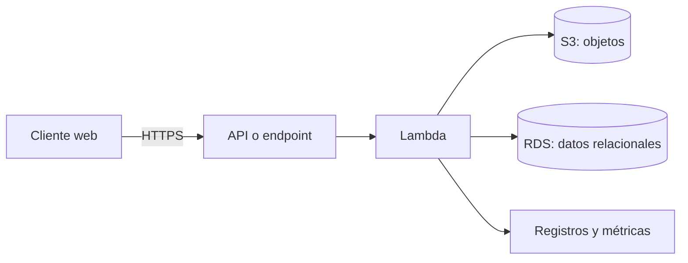

# Tema 3. Servicios distribuidos en AWS

## Cloud computing

El *cloud computing* proporciona capacidad de cómputo, almacenamiento, red y servicios administrados bajo demanda. El proveedor opera la infraestructura física y el usuario crea recursos mediante una consola, API o herramientas de infraestructura como código.

Propiedades principales:

- **autoservicio bajo demanda:** se crean recursos sin instalar hardware;
- **elasticidad:** la capacidad se adapta a la carga;
- **acceso por red:** los servicios se consumen mediante interfaces remotas;
- **recursos compartidos:** la infraestructura física atiende a múltiples clientes manteniendo aislamiento lógico;
- **servicio medido:** el coste depende de la capacidad reservada o consumida.

| Modelo | El proveedor administra | El usuario administra | Ejemplo |
|---|---|---|---|
| IaaS | Hardware, red física y virtualización | SO, runtime, aplicación y datos | EC2 |
| PaaS | Infraestructura, SO y runtime | Aplicación y datos | Plataformas de despliegue gestionadas |
| FaaS | Infraestructura y ejecución de funciones | Función, eventos y datos | Lambda |
| SaaS | Aplicación completa | Configuración y uso | Aplicación web contratada |

## Arquitectura orientada a servicios

Una aplicación cloud puede separar la interfaz, la lógica y la persistencia en servicios independientes. Cada componente escala y falla de forma distinta, por lo que se comunica mediante contratos explícitos y evita depender del estado local de una máquina concreta.



En esta arquitectura:

- S3 puede alojar archivos y contenido estático;
- Lambda ejecuta la lógica cuando recibe una petición o un evento;
- RDS conserva datos estructurados y relaciones;
- los permisos determinan exactamente qué acciones puede realizar cada componente.

## Regiones, zonas y responsabilidad

Una **región** es un área geográfica que contiene varias **zonas de disponibilidad** aisladas. Distribuir recursos entre zonas reduce la dependencia de un único centro de datos. Los recursos regionales y los ligados a una zona deben distinguirse al diseñar la recuperación ante fallos.

La seguridad es una responsabilidad compartida: AWS protege la infraestructura del cloud, mientras que el usuario debe configurar identidades, permisos, red, cifrado, actualizaciones de sus instancias y tratamiento de los datos.

## IAM y permisos

IAM controla quién puede realizar qué acción sobre qué recurso. Una política contiene, entre otros campos:

- `Effect`: permite o deniega;
- `Action`: operaciones afectadas;
- `Resource`: recursos sobre los que se aplican;
- `Condition`: restricciones opcionales.

Debe aplicarse el **principio de mínimo privilegio**. Una función Lambda que lee un bucket debe usar un rol con permiso de lectura sobre ese bucket, no credenciales de administrador incrustadas en el código.

Las credenciales temporales incluyen un token y una fecha de expiración. Si una aplicación las solicita mediante Lambda, debe comprobar que siguen vigentes y renovarlas cuando corresponda.

## EC2

Amazon EC2 ofrece máquinas virtuales. Al crear una instancia se eligen una imagen de sistema, tipo de instancia, almacenamiento, red, grupo de seguridad y par de claves.

### Acceso por SSH

```console
chmod 400 claves.pem
ssh -i claves.pem usuario@IP_O_DNS
```

El grupo de seguridad debe permitir el puerto 22 desde la IP necesaria. No conviene abrir SSH a todo Internet.

Para copiar un archivo:

```console
scp -i claves.pem archivo usuario@IP_O_DNS:directorio
```

## AWS Lambda

Lambda ejecuta funciones en respuesta a eventos sin administrar servidores. Al crear una función se define:

- nombre y región;
- runtime y arquitectura;
- rol de ejecución;
- memoria y tiempo máximo;
- desencadenadores, variables de entorno y permisos.

Una invocación recibe un evento y un contexto y devuelve un resultado. Las funciones deben diseñarse como unidades sin estado persistente local: cualquier información que deba sobrevivir se guarda en S3, RDS u otro servicio.

Aspectos importantes:

- la ejecución puede repetirse tras determinados fallos; las operaciones sensibles deben ser idempotentes cuando sea posible;
- una función tiene tiempo y recursos limitados;
- la primera invocación de un entorno puede sufrir un arranque en frío;
- el rol de ejecución debe autorizar el acceso a los servicios utilizados;
- los secretos no deben almacenarse en el código fuente.

## Amazon S3

S3 almacena **objetos** dentro de **buckets**. Cada objeto tiene una clave, contenido y metadatos. No es un sistema de ficheros tradicional, aunque las claves con `/` puedan mostrarse como carpetas.

### Creación y acceso

Al crear un bucket se eligen un nombre globalmente único y una región. Por defecto debe mantenerse bloqueado el acceso público. Solo se abre cuando el caso de uso lo exige y se comprende el alcance de la política.

Una política pública de lectura para un prefijo concreto tendría esta estructura:

```json
{
  "Version": "2012-10-17",
  "Statement": [
    {
      "Effect": "Allow",
      "Principal": "*",
      "Action": "s3:GetObject",
      "Resource": "arn:aws:s3:::NOMBRE_BUCKET/publico/*"
    }
  ]
}
```

Abrir todo el bucket con `s3:*` o incluir objetos privados sería innecesario y peligroso. Para cargas desde un navegador se configuran además los permisos IAM o URLs prefirmadas y, si el origen es distinto, CORS. La propiedad de objetos debe ser coherente con el mecanismo de subida; el modo recomendado suele mantener al propietario del bucket como propietario efectivo de los objetos y deshabilitar ACL cuando no son necesarias.

### Diseño

- El nombre del bucket no forma parte del contenido, pero sí de su identificador ARN y endpoints.
- El cifrado en reposo debe estar habilitado.
- El versionado permite recuperar objetos sobrescritos o eliminados accidentalmente.
- Las reglas de ciclo de vida mueven o eliminan objetos según su antigüedad.
- Para acceso temporal privado se prefieren URLs prefirmadas frente a hacer público el bucket.

## Amazon RDS

RDS administra motores de bases de datos relacionales como MariaDB, MySQL, PostgreSQL, Oracle o SQL Server. El usuario selecciona motor y versión, clase de instancia, almacenamiento, credenciales, red, copias y opciones de disponibilidad.

### Conectividad

La aplicación se conecta mediante el **endpoint** DNS y el puerto del motor, por ejemplo 3306 para MySQL/MariaDB o 5432 para PostgreSQL. El endpoint debe usarse en lugar de depender de una dirección IP que podría cambiar.

El grupo de seguridad de la base de datos debe aceptar tráfico solo desde el grupo de seguridad de la aplicación o desde una IP administrativa concreta:

```text
Tipo: MySQL/Aurora
Puerto: 3306
Origen: grupo-seguridad-aplicacion
```

Abrir el puerto a `0.0.0.0/0` permite intentos de conexión desde cualquier IP y solo debería contemplarse en un laboratorio controlado y temporal. Para una arquitectura normal, RDS permanece en subredes privadas y no es públicamente accesible.

### Operación

- Las copias automáticas permiten restauración a un punto temporal dentro del periodo configurado.
- Un despliegue Multi-AZ mantiene una réplica para recuperación ante fallos; no equivale a una réplica de lectura.
- El cifrado protege almacenamiento, copias y snapshots.
- Las contraseñas se guardan en un servicio de secretos o configuración segura, no en el repositorio.
- La eliminación debe considerar la protección contra borrado y un snapshot final.

## Elección del servicio de persistencia

| Necesidad | Servicio adecuado |
|---|---|
| Archivos, imágenes, copias o contenido estático | S3 |
| Datos tabulares con relaciones, restricciones y transacciones | RDS |
| Disco de bloques para una instancia concreta | EBS con EC2 |
| Estado temporal de una ejecución | Memoria o almacenamiento efímero, sin asumir persistencia |

## Flujo de despliegue

1. Diseñar los servicios, datos y límites de confianza.
2. Crear roles IAM con los permisos mínimos.
3. Crear S3 y RDS con acceso privado por defecto.
4. Configurar red y grupos de seguridad entre los componentes.
5. Desplegar Lambda o EC2 sin credenciales permanentes embebidas.
6. Probar rutas correctas, errores, reintentos y expiración de credenciales.
7. Activar registros, métricas, copias y cifrado.
8. Eliminar recursos de laboratorio que ya no se utilicen para evitar costes y exposición innecesaria.
