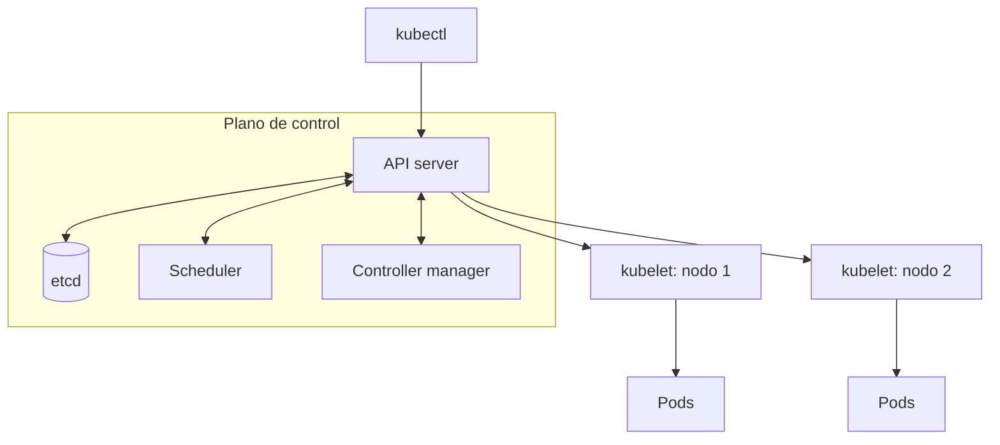

# Tema 2 - Virtualización, Docker y Kubernetes

## Virtualización

La virtualización permite ejecutar simultáneamente varias instancias de sistemas operativos o aplicaciones sobre una misma máquina física. Busca elevar el aprovechamiento del hardware, aislar cargas y simplificar el despliegue y la recuperación.

Sus principales beneficios son una menor inversión y mantenimiento, mayor flexibilidad, consolidación de servidores y mejores mecanismos de aislamiento y tolerancia a fallos.

### Hipervisores

El **hipervisor** o VMM (*Virtual Machine Monitor*) proporciona el hardware virtual sobre el que se ejecutan las máquinas virtuales.

| Tipo | Posición | Características |
|---|---|---|
| Tipo 1 o *bare metal* | Directamente sobre el hardware | Menor sobrecarga y uso habitual en servidores |
| Tipo 2 o alojado | Como aplicación de un sistema operativo anfitrión | Instalación sencilla, pero añade la capa del SO anfitrión |

### Técnicas de virtualización

| Técnica | Funcionamiento | Ventaja | Limitación |
|---|---|---|---|
| Completa | El VMM abstrae y, cuando hace falta, traduce el hardware | Ejecuta sistemas invitados sin modificar | Mayor sobrecarga |
| Asistida por hardware | El procesador captura operaciones privilegiadas mediante extensiones como Intel VT o AMD-V | Reduce la sobrecarga | Requiere soporte del procesador |
| Paravirtualización | El sistema invitado sabe que está virtualizado y usa hiperllamadas | Buen rendimiento | Requiere modificar o adaptar el invitado |
| A nivel de SO | Varias instancias aisladas comparten el kernel anfitrión | Arranque rápido y poco consumo | Todas dependen del mismo tipo de kernel |

Los **contenedores** aplican virtualización a nivel de sistema operativo. Aíslan procesos, red y sistema de ficheros, pero comparten el kernel. Las capas de imagen suelen usar *copy-on-write*: se comparte una base inmutable y solo se almacenan por separado los cambios.

## Docker

Docker construye y ejecuta imágenes de contenedores. Una **imagen** es una plantilla inmutable con la aplicación y sus dependencias; un **contenedor** es una instancia en ejecución de esa imagen. Un registro, como Docker Hub, almacena y distribuye imágenes.

### Comandos básicos

```console
docker login
docker images
docker pull repositorio/imagen:version
docker image rm ID_IMAGEN
docker build -t usuario/imagen:version directorio/
docker push usuario/imagen:version
```

Una etiqueta identifica normalmente el registro o usuario, el nombre y la versión. Si se construye sin `-t`, puede añadirse después:

```console
docker tag ID_IMAGEN usuario/imagen:1.0
```

### Dockerfile

Un `Dockerfile` declara de forma reproducible cómo construir una imagen.

| Instrucción | Función |
|---|---|
| `FROM` | Selecciona la imagen base |
| `RUN` | Ejecuta una orden durante la construcción y crea una capa |
| `COPY` | Copia archivos del contexto de construcción a la imagen |
| `EXPOSE` | Documenta el puerto que usa la aplicación; no lo publica por sí solo |
| `CMD` | Define la orden predeterminada del contenedor |

```dockerfile
FROM ubuntu:20.04
RUN apt-get update && apt-get install -y apache2
COPY index.html /var/www/html/
EXPOSE 80
CMD ["apachectl", "-D", "FOREGROUND"]
```

El contexto pasado a `docker build` debe contener el `Dockerfile` y los archivos que se copian. Conviene agrupar instalaciones, eliminar cachés y fijar versiones cuando la reproducibilidad sea importante.

## Kubernetes

Kubernetes orquesta aplicaciones en contenedores sobre un clúster. Mantiene un estado deseado: programa cargas, crea réplicas, sustituye instancias fallidas y conecta aplicaciones.

Proporciona:

- descubrimiento de servicios y balanceo de carga;
- despliegues declarativos, actualizaciones y vuelta a versiones anteriores;
- asignación de CPU y memoria;
- reinicio o sustitución de contenedores fallidos;
- integración con almacenamiento;
- gestión de configuraciones y secretos.

No compila el código ni impone un lenguaje, una base de datos o una API de paso de mensajes. Tampoco constituye por sí solo una solución completa de registro, monitorización y alertas; esas capacidades se integran mediante otras herramientas.

### Arquitectura del clúster



- El **plano de control** administra el estado del clúster y decide dónde ejecutar las cargas.
- Los **nodos de trabajo** ejecutan pods y se comunican con el plano de control mediante `kubelet`.
- El **runtime de contenedores** descarga imágenes y ejecuta contenedores.
- Un proveedor **CNI** implementa la red entre pods y nodos. Flannel, Calico y Weave son ejemplos.

En producción se replican componentes del plano de control y se usan varios nodos para obtener alta disponibilidad.

## Objetos principales

### Pod

El pod es la unidad mínima que Kubernetes programa. Agrupa uno o varios contenedores que comparten red y pueden compartir volúmenes. Lo habitual es ejecutar un contenedor principal por pod; varios contenedores se agrupan cuando cooperan estrechamente.

Los pods son reemplazables y su sistema de ficheros local es efímero. No deben tratarse como servidores permanentes con identidad manual.

### Deployment

Un `Deployment` declara una plantilla de pod y un número de réplicas. Su controlador crea y sustituye pods hasta alcanzar el estado deseado y permite actualizaciones controladas.

### Service

Un `Service` ofrece una dirección estable para un conjunto cambiante de pods y selecciona sus destinos mediante etiquetas.

- `ClusterIP`: accesible solo dentro del clúster.
- `NodePort`: publica un puerto en los nodos.
- `LoadBalancer`: solicita un balanceador al proveedor compatible.

### Volúmenes

Un volumen desacopla los datos del ciclo de vida del contenedor. `hostPath` monta una ruta del nodo y resulta útil en laboratorios, pero liga el pod a ese equipo. Para cargas distribuidas se emplean volúmenes de red o almacenamiento proporcionado por la nube, normalmente mediante `PersistentVolume` y `PersistentVolumeClaim`.

## Administración del clúster

`kubeadm` inicializa o incorpora nodos; `kubectl` administra los objetos a través de la API.

```console
# Crear el plano de control
sudo kubeadm init

# Obtener de nuevo la orden para incorporar nodos
kubeadm token create --print-join-command

# Ejecutar en un nodo de trabajo
sudo kubeadm join IP_CONTROL:PUERTO --token TOKEN \
  --discovery-token-ca-cert-hash sha256:HASH

# Deshacer la configuración local de kubeadm
sudo kubeadm reset
```

Para que un usuario emplee `kubectl`, necesita un archivo `kubeconfig`:

```console
mkdir -p "$HOME/.kube"
sudo cp /etc/kubernetes/admin.conf "$HOME/.kube/config"
sudo chown "$(id -u):$(id -g)" "$HOME/.kube/config"
```

La instalación del laboratorio requiere nodos Linux comunicados, al menos 2 CPU y 2 GB de RAM para el nodo de control, reenvío IPv4, puertos del clúster accesibles y la *swap* desactivada. Las versiones exactas de paquetes y repositorios deben mantenerse compatibles entre sí.

| Puerto TCP | Componente o uso |
|---|---|
| 6443 | API server |
| 2379-2380 | Cliente y pares de `etcd` |
| 10250 | API de `kubelet` |
| 10257 | Controller manager |
| 10259 | Scheduler |
| 30000-32767 | Intervalo predeterminado de `NodePort` |

## Uso de kubectl

```console
kubectl get nodes
kubectl get pods
kubectl get deployments
kubectl get services

kubectl describe pod NOMBRE
kubectl exec -it NOMBRE_POD -- bash

kubectl create deployment web --image=usuario/imagen:1.0 --replicas=3
kubectl expose deployment web --type=NodePort --port=8080

kubectl delete service web
kubectl delete deployment web
```

`get` muestra una vista breve; `describe` incluye estado, eventos y configuración. `exec` inicia una orden dentro de un contenedor en ejecución.

## Configuración declarativa con YAML

Los manifiestos suelen contener:

- `apiVersion`: versión de la API;
- `kind`: tipo de objeto;
- `metadata`: nombre, espacio de nombres y etiquetas;
- `spec`: estado deseado.

Se aplican de forma declarativa:

```console
kubectl apply -f archivo.yaml
```

### Deployment

```yaml
apiVersion: apps/v1
kind: Deployment
metadata:
  name: bootcamp
spec:
  replicas: 3
  selector:
    matchLabels:
      app: bootcamp
  template:
    metadata:
      labels:
        app: bootcamp
    spec:
      containers:
        - name: bootcamp
          image: docker.io/jocatalin/kubernetes-bootcamp:v2
          ports:
            - containerPort: 8080
```

El selector del `Deployment` y las etiquetas de la plantilla deben coincidir.

### Service

```yaml
apiVersion: v1
kind: Service
metadata:
  name: bootcamp-entrypoint
spec:
  type: NodePort
  selector:
    app: bootcamp
  ports:
    - port: 8080
      targetPort: 8080
      nodePort: 31000
```

El selector enlaza el servicio con los pods que llevan `app: bootcamp`. `port` es el puerto del servicio, `targetPort` el del contenedor y `nodePort` el publicado en cada nodo.

### Volumen local de laboratorio

```yaml
spec:
  template:
    spec:
      containers:
        - name: bootcamp
          image: docker.io/jocatalin/kubernetes-bootcamp:v2
          volumeMounts:
            - name: datos
              mountPath: /prueba
      volumes:
        - name: datos
          hostPath:
            path: /home/ubuntu/compartido
            type: Directory
```

El nombre definido en `volumeMounts` debe coincidir con el de `volumes`. Si el pod se reprograma en otro nodo, un `hostPath` apuntará al almacenamiento local de ese nuevo nodo, por lo que no ofrece persistencia distribuida.
