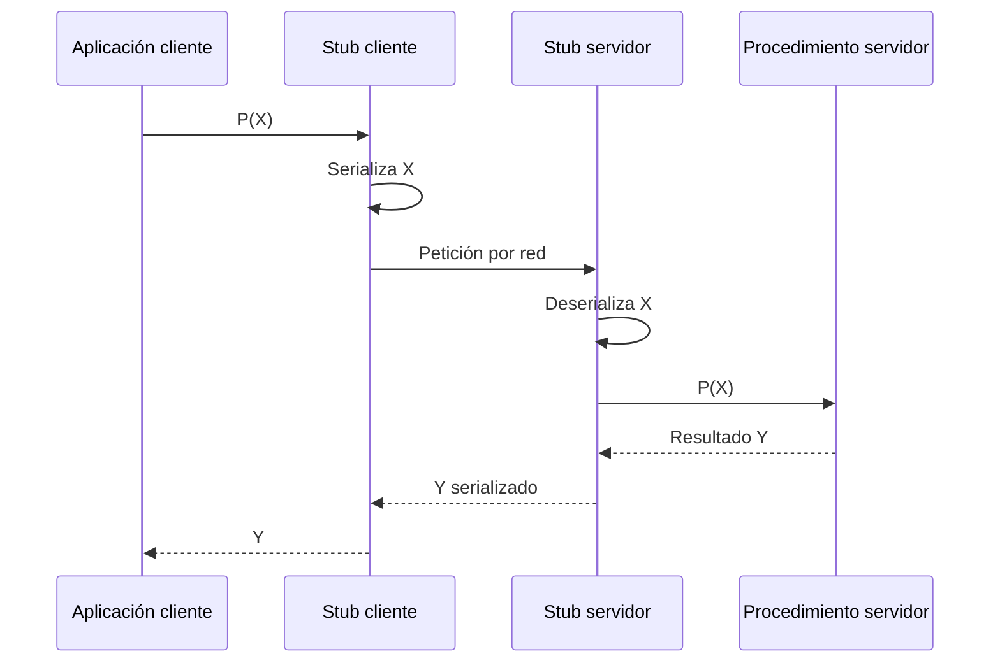

# Tema 2A. Procesos distribuidos y clústeres

## Sistemas de memoria distribuida

Un sistema de memoria distribuida o **multicomputador** está formado por nodos completos e independientes conectados por una red. Cada nodo tiene su propio procesador y memoria; no existe un espacio de direcciones compartido por todos. Por ello, los procesos se comunican mediante mensajes.

El procesamiento de datos distribuido (DDP) reparte datos y trabajo entre computadores conectados para aprovechar el paralelismo y la replicación. Como los nodos y la red pueden fallar, el diseño debe contemplar pérdidas de comunicación, caídas, recuperación y consistencia de los datos.

### Propiedades

- **Disponibilidad:** una réplica puede asumir el servicio si falla otra unidad.
- **Compartición de recursos:** hardware, software y datos pueden utilizarse desde distintos nodos.
- **Crecimiento incremental:** se incorporan equipos nuevos sin desechar necesariamente los anteriores.
- **Productividad y rendimiento:** una carga divisible puede ejecutarse en paralelo.
- **Autonomía:** cada nodo puede gestionar sus recursos, aunque debe coordinarse para usar los compartidos.

El sistema operativo y el middleware deben proporcionar intercambio de datos, gestión de procesos, alta disponibilidad, prestaciones y seguridad. La distribución amplía la superficie de ataque, por lo que son esenciales la autenticación, la protección de recursos y el cifrado de las comunicaciones.

## Arquitectura cliente/servidor

- El **cliente** ofrece la interfaz al usuario y solicita operaciones.
- El **servidor** administra recursos y presta servicios compartidos.
- La **API** define las operaciones con las que se comunican.
- El **middleware** oculta diferencias de red, sistema operativo o plataforma y ofrece una visión uniforme del sistema.

| Tipo | Reparto del procesamiento | Ejemplo |
|---|---|---|
| Basado en host | El servidor realiza todo el trabajo; el cliente es un terminal | Terminal remoto |
| Basado en servidor | El cliente presenta la interfaz y el servidor ejecuta la lógica | Aplicación web, base de datos |
| Basado en cliente | El cliente procesa y el servidor valida o coordina | Determinados juegos en red |
| Cooperativo | Cliente y servidor reparten la carga | Aplicación con datos distribuidos |

## Paso de mensajes

Dos operaciones básicas permiten comunicar y sincronizar procesos:

- `send(destino, datos)` envía una petición y sus parámetros a un nodo.
- `receive(origen, buffer)` recibe un mensaje de un nodo concreto o de cualquiera.

El middleware orientado a mensajes proporciona estas operaciones sin que la aplicación gestione directamente la red.

### Fiabilidad

| Modalidad | Comportamiento | Coste |
|---|---|---|
| Fiable | Controla errores, confirma recepción, retransmite y reordena cuando es necesario | Mayor tráfico y complejidad |
| No fiable | No garantiza la entrega | Menor sobrecarga; la aplicación debe implementar las garantías necesarias |

### Bloqueo

- Una operación **bloqueante** detiene al proceso hasta que el envío o la recepción alcanza el estado esperado.
- Una operación **no bloqueante** devuelve el control tras iniciar la operación. El programa recibe un identificador o estado que consulta más tarde. Hasta que termine, no debe reutilizar el búfer asociado.

Las operaciones no bloqueantes permiten solapar comunicación y cálculo, algo importante porque una red tiene mucha más latencia que la memoria local.

## Llamadas a procedimientos remotos

Una **RPC** (*Remote Procedure Call*) presenta una operación remota como si fuera una llamada a una función local. Encapsula los `send` y `receive`, la localización del servidor y la serialización de los datos.

1. La aplicación invoca el procedimiento definido en la interfaz.
2. El **stub cliente** empaqueta o serializa los argumentos y envía la petición.
3. El **stub servidor** desempaqueta los datos e invoca la implementación local.
4. El resultado recorre el camino inverso.

La interfaz remota especifica nombres, operaciones y tipos. A partir de ella pueden generarse automáticamente los stubs, comprobar datos y construir clientes y servidores portables.

### Representación de parámetros

Cliente y servidor pueden usar lenguajes, arquitecturas y representaciones binarias distintas. Los datos deben convertirse a un formato común antes de enviarse y reconstruirse al recibirlos. Esta serialización facilita la interoperabilidad, pero consume tiempo de CPU y aumenta el volumen de datos.

No se debe asumir que una RPC tiene la misma semántica que una llamada local: la red o el servidor pueden fallar, puede agotarse el tiempo de espera y una retransmisión puede repetir una operación.

### Broker de objetos

Un broker extiende la idea de RPC a objetos distribuidos. Actúa como directorio: recibe la solicitud de un cliente, localiza el objeto que ofrece el servicio y conecta ambas partes. CORBA y COM son ejemplos de este enfoque.

## Clústeres

Un clúster conecta nodos para ejecutar aplicaciones como si dispusieran de una plataforma coordinada. Puede clasificarse según varias dimensiones:

- **dedicado o no dedicado**, según sus nodos se reserven para el clúster;
- **homogéneo o heterogéneo**, según compartan arquitectura y configuración;
- **propietario o Beowulf**, según utilice soluciones específicas o hardware convencional y software abierto.

Las aplicaciones habituales incluyen servicios de Internet, bases de datos, renderizado, simulación científica y cálculo intensivo. Una configuración básica usa una red de alta velocidad y, frecuentemente, almacenamiento compartido o un sistema de ficheros distribuido.

### Aspectos de diseño

- **Alta disponibilidad:** el servicio continúa aunque se pierda un nodo, aunque las peticiones que ejecutaba pueden perderse.
- **Tolerancia a fallos:** la redundancia, replicación y migración permiten conservar también el trabajo ante un fallo.
- **Balanceo de carga:** el planificador distribuye procesos entre nodos e incorpora nuevos recursos.
- **Descubrimiento de servicios:** el middleware detecta qué servicios ofrece cada miembro.
- **Paralelismo:** puede extraerlo un compilador o programarlo explícitamente el desarrollador mediante una API de mensajes. El enfoque explícito exige más trabajo, pero permite controlar mejor la distribución.

## Migración de procesos

La migración transfiere suficiente estado de un proceso a otro computador para continuar allí su ejecución. Sirve para equilibrar carga, acercar procesos que se comunican mucho, mantener disponibilidad o acceder a hardware especializado.

Antes de migrar hay que decidir:

- quién inicia la operación: un monitor del sistema o la propia aplicación;
- qué estado se transfiere: bloque de control, memoria, ficheros, señales y mensajes;
- cómo localizar el proceso tras el cambio y redirigir las comunicaciones pendientes;
- qué nodo puede aceptar la carga.

### Estrategias de transferencia de memoria

| Estrategia | Funcionamiento | Ventaja | Inconveniente |
|---|---|---|---|
| Copia completa | Detiene el proceso y transfiere todo su espacio de memoria | El origen queda liberado | Pausa y transferencia grandes |
| Precopia | Copia mientras el proceso sigue activo y reenvía las páginas modificadas | Reduce la pausa final | Puede recopiarlas varias veces |
| Copia parcial | Envía las páginas recientes y trae el resto bajo demanda | Menos datos iniciales | Mantiene estado en el origen |
| Copiar al referenciar | Trae cada página cuando se utiliza | Inicio rápido | Fallos de página remotos posteriores |
| Volcado compartido | Guarda la memoria en un sistema de ficheros accesible por ambos nodos | Libera la RAM del origen | Depende del almacenamiento compartido |

Los hilos complican la migración porque comparten el espacio de direcciones. Si solo migra parte de ellos, la memoria puede quedar repartida y requerir acceso remoto. Los ficheros abiertos también exigen redirección, copia controlada o cachés coherentes.

### Negociación entre nodos

Un planificador puede recopilar la carga de varios equipos. El origen solicita permiso al destino, envía las características del proceso y el destino reserva recursos antes de confirmar la inmigración. La decisión debe revalidarse porque la carga puede cambiar durante la negociación.

## Exclusión mutua distribuida

Cuando varios nodos usan un recurso compartido debe garantizarse que solo uno permanezca en la sección crítica. Además:

- una petición no debe esperar indefinidamente;
- si el recurso está libre, alguna petición debe progresar;
- no se puede depender de la velocidad relativa de los procesos;
- cada acceso debe durar un tiempo finito.

En un sistema distribuido no existe de forma natural un reloj global perfecto y los mensajes pueden sufrir retrasos distintos. El algoritmo necesita algún criterio de orden total, como marcas lógicas y un desempate por identificador de proceso.

### Cola distribuida

Un enfoque consiste en replicar una cola FIFO del recurso en todos los nodos:

1. El proceso `Pi` encola su solicitud local y la difunde.
2. Los demás nodos insertan la solicitud en el mismo orden y responden con una confirmación.
3. `Pi` entra cuando su solicitud es la primera y ha recibido las confirmaciones necesarias.
4. Al salir, difunde un mensaje para retirar su solicitud.
5. Cada nodo actualiza su cola y comprueba quién puede entrar después.

Este esquema depende de la entrega y del orden previstos. Si un nodo falla o un mensaje se pierde, puede detener el progreso; un algoritmo real debe incorporar detección de fallos, reintentos y reglas precisas de ordenación.
