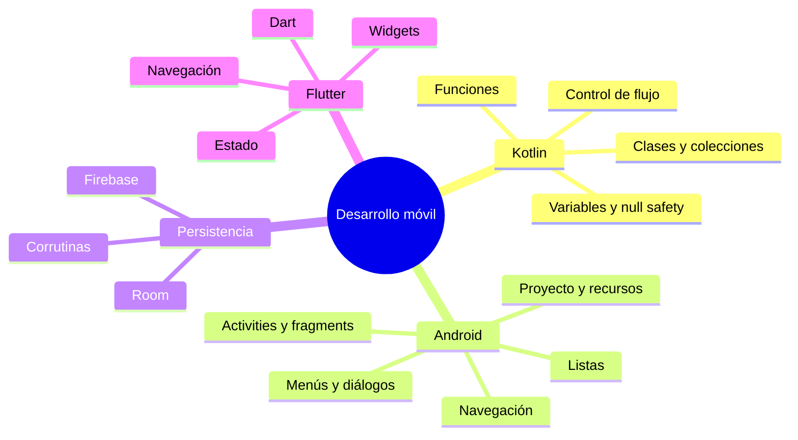
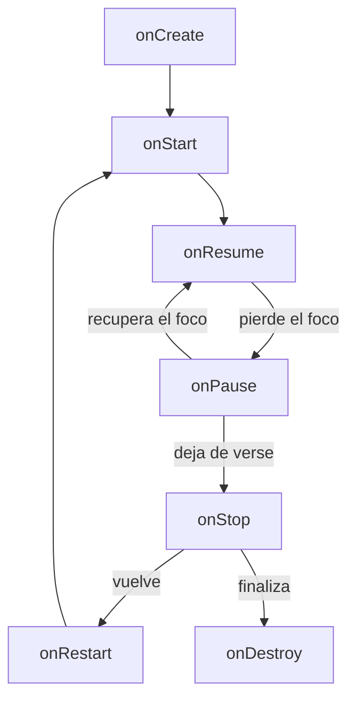
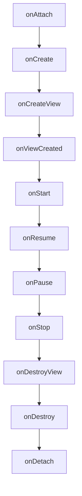
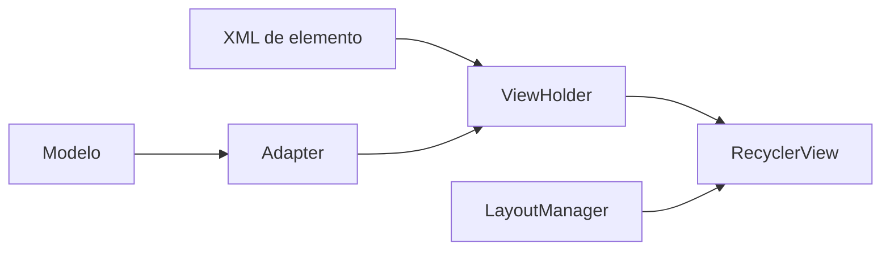
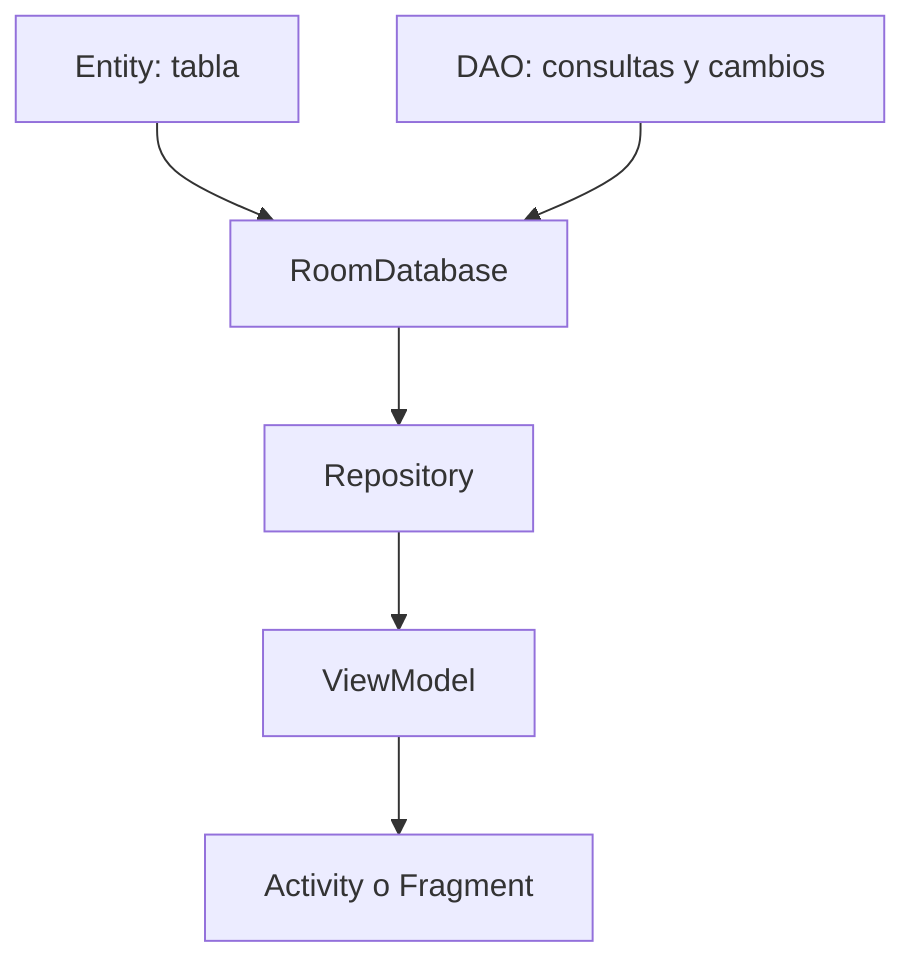
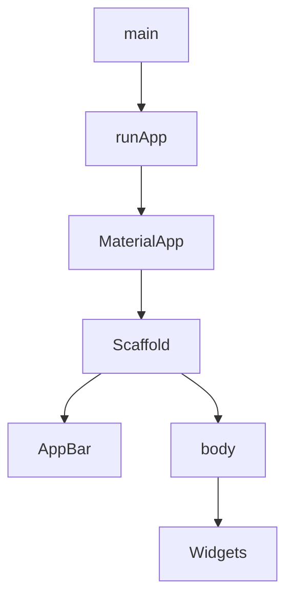
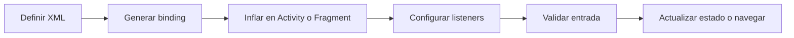
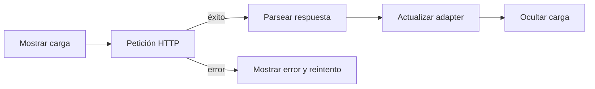

# Android, Kotlin, Dart y Flutter

> Material de consulta sobre los fundamentos usados en la asignatura. Se presta especial atención a los ciclos de vida de `Activity` y `Fragment`, los recursos Android, la navegación, la persistencia y la sintaxis de Kotlin y Dart.

## Mapa general



## 1. Kotlin

### 1.1. Conceptos básicos

| Concepto | Descripción | Ejemplo |
| --- | --- | --- |
| Extensión | Los archivos Kotlin terminan en `.kt`. | `MainActivity.kt` |
| Punto de entrada | Un programa Kotlin independiente comienza en `main`. | `fun main() {}` |
| `var` | Variable reasignable. | `var edad = 20` |
| `val` | Referencia no reasignable. | `val pi = 3.14` |
| Inferencia | El compilador deduce el tipo cuando es inequívoco. | `val nombre = "Ana"` |
| Visibilidad | `public`, `private`, `protected` e `internal`. | `private var contador = 0` |
| Miembros de clase | No existe `static`; se usan objetos o `companion object`. | `companion object { ... }` |
| Herencia | Las clases y métodos son finales por defecto. | `open class Persona` |

### 1.2. Variables y null safety

| Sintaxis | Significado | Uso |
| --- | --- | --- |
| `String` | Nunca admite `null`. | Datos obligatorios. |
| `String?` | Puede contener `null`. | Datos opcionales. |
| `obj?.metodo()` | Ejecuta la llamada solo si `obj` no es nulo. | Opción segura habitual. |
| `obj!!` | Afirma que el valor no es nulo; puede lanzar `NullPointerException`. | Solo con certeza real. |
| `a ?: b` | Usa `b` cuando `a` es nulo. | Valores por defecto. |
| `lateinit var` | Retrasa la inicialización de una propiedad no nula. | Bindings y dependencias. |

```kotlin
val nombre: String? = null
println(nombre?.length ?: 0)

lateinit var binding: ActivityMainBinding
```

### 1.3. Control de flujo

`if` y `when` son expresiones: pueden producir directamente un valor.

```kotlin
val resultado = when (nota) {
    !in 0..10 -> "Nota incorrecta"
    in 5..9 -> "Aprobado"
    10 -> "Matrícula"
    else -> "Suspenso"
}

for (i in 10 downTo 0 step 2) println(i)
lista.forEachIndexed { indice, valor -> println("$indice: $valor") }
```

### 1.4. Funciones

```kotlin
fun saludar() = println("Hola")
fun sumar(a: Int, b: Int = 0): Int = a + b

val operacion: (Int, Int) -> Int = { a, b -> a + b }
sumar(a = 2, b = 3)
```

Los parámetros nombrados mejoran la legibilidad y los valores por defecto evitan sobrecargas sencillas. Las lambdas se usan con frecuencia en listeners, colecciones y APIs asíncronas.

### 1.5. Arrays y colecciones

| Tipo | Creación | Característica |
| --- | --- | --- |
| Array | `arrayOf(1, 2, 3)` | Tamaño fijo. |
| Array primitivo | `intArrayOf(1, 2, 3)` | Evita envolver cada `Int`. |
| Lista inmutable | `listOf("A", "B")` | No permite añadir ni borrar. |
| Lista mutable | `mutableListOf("A")` | Admite cambios. |
| Mapa | `mapOf("id" to 1)` | Pares clave-valor. |

```kotlin
val lenguajes = listOf("Java", "Kotlin", "Dart")
val largos = lenguajes.filter { it.length > 4 }
val iniciales = lenguajes.map { it.first() }
val encontrado = lenguajes.find { it.startsWith("Kot") }
```

### 1.6. Clases, herencia e interfaces

```kotlin
open class Persona(open val nombre: String) {
    open fun mostrar() = println(nombre)
}

data class Usuario(val id: Long, val email: String)

class Trabajador(
    override val nombre: String,
    val numeroSS: Int
) : Persona(nombre) {
    override fun mostrar() = println("$nombre - $numeroSS")
}

interface Seleccionable {
    fun seleccionar()
}
```

Una `data class` genera `equals`, `hashCode`, `toString`, `copy` y funciones de desestructuración a partir de las propiedades del constructor primario.

## 2. Proyecto Android, recursos y XML

### 2.1. Componentes principales

| Componente | Responsabilidad |
| --- | --- |
| `Activity` | Ventana y punto de entrada de una pantalla. |
| `Fragment` | Parte reutilizable de una interfaz, alojada por una activity. |
| `Service` | Trabajo sin interfaz directa. |
| `BroadcastReceiver` | Recepción de eventos del sistema o de otras aplicaciones. |
| `ContentProvider` | Intercambio estructurado de datos entre aplicaciones. |
| `Intent` | Solicitud para abrir un componente o ejecutar una acción. |

### 2.2. Estructura habitual

| Ruta | Contenido |
| --- | --- |
| `AndroidManifest.xml` | Componentes, permisos, tema y activity de inicio. |
| `java/` o `kotlin/` | Activities, fragments, modelos y adaptadores. |
| `res/layout` | Interfaces XML. |
| `res/drawable` | Imágenes, vectores y formas. |
| `res/mipmap` | Iconos del launcher por densidad. |
| `res/values` | Textos, colores, dimensiones y temas. |
| `res/menu` | Menús de opciones o contextuales. |
| `res/navigation` | Grafos de Navigation Component. |

### 2.3. Referencias a recursos

| Recurso | XML | Kotlin |
| --- | --- | --- |
| String | `@string/saludo` | `getString(R.string.saludo)` |
| Color | `@color/primario` | `ContextCompat.getColor(context, R.color.primario)` |
| Dimensión | `@dimen/margen` | `resources.getDimension(R.dimen.margen)` |
| Drawable | `@drawable/logo` | `setImageResource(R.drawable.logo)` |
| Layout | Se infla por nombre. | `setContentView(R.layout.activity_main)` |
| Array | `@array/paises` | `resources.getStringArray(R.array.paises)` |

Los textos visibles deben estar en `strings.xml`; las medidas reutilizadas, en `dimens.xml`. Esto facilita traducciones y variantes según tamaño, orientación o tema.

### 2.4. View Binding

Con `viewBinding = true`, Gradle genera una clase por cada layout. Evita conversiones y búsquedas manuales con `findViewById`.

```kotlin
private lateinit var binding: ActivityMainBinding

override fun onCreate(savedInstanceState: Bundle?) {
    super.onCreate(savedInstanceState)
    binding = ActivityMainBinding.inflate(layoutInflater)
    setContentView(binding.root)
    binding.buttonSave.setOnClickListener { guardar() }
}
```

En un fragment, el binding solo es válido entre `onCreateView` y `onDestroyView`:

```kotlin
private var _binding: FragmentMainBinding? = null
private val binding get() = _binding!!

override fun onDestroyView() {
    super.onDestroyView()
    _binding = null
}
```

## 3. Ciclo de vida de una Activity



| Método | Uso habitual |
| --- | --- |
| `onCreate` | Inflar la UI, inicializar dependencias y restaurar estado. |
| `onStart` | Preparar recursos necesarios mientras la pantalla sea visible. |
| `onResume` | Iniciar cámara, sensores o listeners exclusivos del primer plano. |
| `onPause` | Pausar operaciones breves; debe terminar rápido. |
| `onStop` | Liberar recursos que no hacen falta en segundo plano. |
| `onDestroy` | Limpieza final cuando la instancia se destruye. |

Un giro de pantalla suele destruir y recrear la activity. El estado pequeño de interfaz puede conservarse con `onSaveInstanceState`; el estado de pantalla debería vivir en un `ViewModel`.

## 4. Ciclo de vida de un Fragment



El fragment tiene un ciclo de vida propio y otro para su vista. Puede seguir existiendo después de destruirse el XML, razón por la que no debe conservar referencias al binding tras `onDestroyView`.

| Aspecto | Activity | Fragment |
| --- | --- | --- |
| Contexto | Es un `Context`. | Usa `requireContext()` o la activity anfitriona. |
| Interfaz | `setContentView`. | Devuelve una vista en `onCreateView`. |
| Navegación | Intents o Navigation Component. | Normalmente `findNavController()`. |
| Reutilización | Representa una ventana. | Puede combinarse dentro de distintas pantallas. |

## 5. Interfaz gráfica Android

### 5.1. Layouts

| Layout | Uso |
| --- | --- |
| `LinearLayout` | Coloca hijos en una fila o columna. |
| `ConstraintLayout` | Expresa relaciones flexibles entre vistas. |
| `FrameLayout` | Apila vistas; habitual como contenedor. |
| `ScrollView` | Permite desplazar un único hijo de contenido. |

`dp` representa dimensiones físicas aproximadas y se usa para tamaños y márgenes. `sp` respeta además el tamaño de fuente configurado por el usuario.

### 5.2. Vistas y eventos

```kotlin
binding.buttonLogin.setOnClickListener {
    val email = binding.editEmail.text.toString().trim()
    if (email.isBlank()) {
        binding.editEmail.error = getString(R.string.required_field)
        return@setOnClickListener
    }
}
```

### 5.3. Spinner

```kotlin
val adapter = ArrayAdapter.createFromResource(
    requireContext(),
    R.array.paises,
    android.R.layout.simple_spinner_item
)
adapter.setDropDownViewResource(android.R.layout.simple_spinner_dropdown_item)
binding.spinnerCountries.adapter = adapter
```

## 6. Intents y navegación

| Tipo | Ejemplo |
| --- | --- |
| Explícito | `Intent(this, DetailActivity::class.java)` |
| Implícito | `Intent(Intent.ACTION_VIEW, Uri.parse(url))` |
| Con extras | `intent.putExtra("id", product.id)` |
| Con resultado | Activity Result API para cámara, permisos o documentos. |

Navigation Component centraliza destinos y acciones de fragments en un grafo:

```kotlin
findNavController().navigate(
    R.id.action_listFragment_to_detailFragment,
    bundleOf("product" to product)
)
```

Los argumentos deben ser pequeños. Para objetos complejos se puede usar `Parcelable`, `Serializable` en ejercicios sencillos o, preferiblemente, pasar un identificador y recuperar los datos en el destino.

## 7. Listas en Android

| Vista | Cuándo usarla | Adaptador |
| --- | --- | --- |
| `Spinner` | Selección desplegable. | `ArrayAdapter` |
| `ListView` | Listas sencillas heredadas. | `ArrayAdapter` o `BaseAdapter` |
| `RecyclerView` | Listas grandes o personalizadas. | `RecyclerView.Adapter` |



El adaptador crea holders en `onCreateViewHolder`, asocia cada modelo en `onBindViewHolder` y devuelve el tamaño en `getItemCount`. Los clics se comunican al fragment mediante una lambda:

```kotlin
class ProductAdapter(
    private val onClick: (Product) -> Unit
) : RecyclerView.Adapter<ProductViewHolder>() {
    override fun onBindViewHolder(holder: ProductViewHolder, position: Int) {
        val product = products[position]
        holder.itemView.setOnClickListener { onClick(product) }
    }
}
```

## 8. Diálogos, menús, toolbar y notificaciones

`AlertDialog.Builder` permite avisos, confirmaciones y listas. Para un diálogo reutilizable y consciente del ciclo de vida se emplea `DialogFragment`.

```kotlin
AlertDialog.Builder(requireContext())
    .setTitle("Eliminar")
    .setMessage("¿Quieres continuar?")
    .setPositiveButton("Sí") { _, _ -> eliminar() }
    .setNegativeButton("No", null)
    .show()
```

Los menús se definen en `res/menu` y se inflan desde la activity o con `MenuProvider`. Una toolbar se establece como barra de aplicación mediante `setSupportActionBar(binding.toolbar)`.

Desde Android 8, toda notificación pertenece a un `NotificationChannel`. Después se construye con `NotificationCompat.Builder` y se publica con `NotificationManagerCompat.notify`.

## 9. Persistencia, corrutinas y Firebase

### 9.1. Comparación

| Tecnología | Tipo | Uso |
| --- | --- | --- |
| SQLite | Base de datos relacional local. | Control SQL directo y aprendizaje. |
| Room | Abstracción sobre SQLite. | Persistencia local tipada. |
| Firebase Realtime Database | Base NoSQL remota por nodos. | Sincronización en tiempo real. |
| Firebase Auth | Servicio de autenticación. | Inicio de sesión y proveedores externos. |
| Firebase Storage | Almacenamiento de archivos. | Imágenes y documentos remotos. |

### 9.2. Room



```kotlin
@Entity
data class Usuario(
    @PrimaryKey(autoGenerate = true) val id: Long = 0,
    val nombre: String,
    val email: String
)

@Dao
interface UsuarioDao {
    @Query("SELECT * FROM Usuario")
    suspend fun selectAll(): List<Usuario>

    @Insert
    suspend fun insert(usuario: Usuario): Long
}
```

### 9.3. Corrutinas

| Dispatcher o scope | Responsabilidad |
| --- | --- |
| `Dispatchers.Main` | Actualizaciones de UI. |
| `Dispatchers.IO` | Red, ficheros y bases de datos. |
| `Dispatchers.Default` | Cálculo intensivo. |
| `lifecycleScope` | Trabajo ligado a una activity o fragment. |
| `viewModelScope` | Trabajo ligado a un `ViewModel`. |
| `withContext` | Cambio de dispatcher dentro de una corrutina. |

Debe evitarse `GlobalScope` para trabajo de pantalla porque no se cancela junto con su ciclo de vida.

### 9.4. Firebase

```kotlin
val auth = FirebaseAuth.getInstance()

auth.signInWithEmailAndPassword(email, password)
    .addOnCompleteListener { task ->
        if (task.isSuccessful) {
            val uid = auth.currentUser?.uid ?: return@addOnCompleteListener
            database.reference.child("users").child(uid).get()
        }
    }
```

En Realtime Database, `setValue` crea o reemplaza un nodo, `removeValue` lo elimina y los listeners reciben `DataSnapshot`. Las reglas de seguridad deben validar el usuario autenticado; ocultar la URL del proyecto no sustituye esas reglas.

## 10. Dart

### 10.1. Sintaxis y null safety

| Concepto | Dart | Equivalente aproximado en Kotlin |
| --- | --- | --- |
| Mutable inferido | `var nombre = 'Ana';` | `var nombre = "Ana"` |
| Constante de compilación | `const pi = 3.14;` | `const val` |
| Valor final en ejecución | `final id = calcular();` | `val` |
| Nullable | `int? edad;` | `Int?` |
| Afirmación no nula | `edad!` | `edad!!` |
| Valor alternativo | `valor ?? 0` | `valor ?: 0` |
| Inicialización tardía | `late String nombre;` | `lateinit var` |

### 10.2. Funciones y colecciones

```dart
int sumar(int a, int b) => a + b;

void registrar({required String nombre, int edad = 0}) {
  print('$nombre - $edad');
}

final lenguajes = <String>['Dart', 'Kotlin'];
final usuario = <String, dynamic>{'nombre': 'Ana', 'edad': 20};
```

### 10.3. Clases, herencia y mixins

```dart
class Usuario {
  final String nombre;
  final String correo;

  Usuario({required this.nombre, required this.correo});
  Usuario.sinCorreo(this.nombre) : correo = '';
}

class Administrador extends Usuario with Auditable {
  Administrador({required super.nombre, required super.correo});
}
```

Un nombre que empieza por `_` es privado para su librería. Los mixins comparten comportamiento sin formar una jerarquía de herencia adicional.

### 10.4. Asincronía

```dart
Future<String> cargar() async {
  final respuesta = await cliente.get(url);
  return respuesta.body;
}

try {
  print(await cargar());
} catch (error) {
  print('No se pudo cargar: $error');
}
```

`Future<T>` representa un resultado futuro. `await` suspende la función `async` sin bloquear el hilo de interfaz.

## 11. Flutter

### 11.1. Estructura y árbol de widgets

| Ruta | Contenido |
| --- | --- |
| `lib/main.dart` | Punto de entrada. |
| `pubspec.yaml` | Dependencias, assets y metadatos. |
| `android/`, `ios/`, `web/` | Configuración específica de plataforma. |
| `test/` | Pruebas unitarias y de widgets. |



### 11.2. StatelessWidget y StatefulWidget

| Tipo | Estado | Uso |
| --- | --- | --- |
| `StatelessWidget` | No mantiene estado mutable interno. | Contenido derivado solo de parámetros. |
| `StatefulWidget` | Delega el estado mutable a un objeto `State`. | Formularios, contadores y carga asíncrona. |

```dart
class CounterPage extends StatefulWidget {
  const CounterPage({super.key});

  @override
  State<CounterPage> createState() => _CounterPageState();
}

class _CounterPageState extends State<CounterPage> {
  int count = 0;

  @override
  Widget build(BuildContext context) {
    return ElevatedButton(
      onPressed: () => setState(() => count++),
      child: Text('$count'),
    );
  }
}
```

`setState` debe envolver únicamente el cambio de datos que obliga a reconstruir la interfaz. El trabajo costoso o de red no se ejecuta dentro de su callback.

### 11.3. Widgets habituales

| Grupo | Widgets |
| --- | --- |
| Estructura | `MaterialApp`, `Scaffold`, `AppBar` |
| Distribución | `Row`, `Column`, `Stack`, `Expanded`, `Padding` |
| Contenido | `Text`, `Image`, `Icon`, `Card` |
| Entrada | `TextField`, `Checkbox`, `Switch`, `DropdownButton` |
| Acciones | `ElevatedButton`, `IconButton`, `FloatingActionButton` |
| Listas | `ListView`, `GridView`, `ListTile` |

### 11.4. Navegación

```dart
final resultado = await Navigator.push<String>(
  context,
  MaterialPageRoute(builder: (_) => const DetailPage()),
);

if (context.mounted) {
  Navigator.pop(context, 'guardado');
}
```

Para aplicaciones pequeñas basta `Navigator`. Cuando existen rutas profundas, enlaces externos o navegación web, conviene un enrutador declarativo.

## 12. Kotlin y Dart: equivalencias rápidas

| Objetivo | Kotlin | Dart |
| --- | --- | --- |
| Mutable | `var x = 1` | `var x = 1;` |
| Solo lectura | `val x = 1` | `final x = 1;` |
| Nullable | `String?` | `String?` |
| Alternativa a nulo | `a ?: b` | `a ?? b` |
| Interpolación | `"Hola $nombre"` | `'Hola $nombre'` |
| Lista | `mutableListOf<T>()` | `<T>[]` |
| Mapa | `mutableMapOf<K, V>()` | `<K, V>{}` |
| Herencia | `class B : A()` | `class B extends A` |
| Asíncrono | `suspend`, corrutinas | `async`, `await`, `Future` |

## 13. Flujos de implementación

### Pantalla Android con XML



### Carga de una API en RecyclerView



### Formulario

1. Leer y normalizar los campos.
2. Comprobar campos obligatorios y formato.
3. Desactivar el envío mientras se procesa.
4. Ejecutar la operación asíncrona.
5. Mostrar el resultado o un error accionable.
6. Restaurar el control si la operación termina.

## 14. Ejemplos del proyecto de clase

### 14.1. Login con Firebase Auth

El proyecto usa fragments y Navigation Component. El login valida los campos, llama a Firebase Auth y navega solo si la tarea termina correctamente.

```kotlin
auth.signInWithEmailAndPassword(email, password)
    .addOnCompleteListener { task ->
        binding.progress.visibility = View.GONE
        if (task.isSuccessful) {
            findNavController().navigate(R.id.action_loginFragment_to_mainFragment)
        } else {
            Snackbar.make(binding.root, "No se pudo iniciar sesión", Snackbar.LENGTH_LONG).show()
        }
    }
```

### 14.2. Catálogo remoto

El catálogo integrado conserva las capacidades del proyecto basado en activities:

- descarga productos y categorías desde DummyJSON mediante Volley;
- convierte JSON a modelos Kotlin con Gson;
- muestra imágenes con Glide;
- adapta el RecyclerView a lista vertical o cuadrícula según orientación;
- filtra por categoría;
- abre el detalle mediante Navigation Component;
- mantiene un carrito en memoria y calcula el total.

### 14.3. Imágenes remotas con Glide

```kotlin
Glide.with(binding.imageProduct)
    .load(product.thumbnail)
    .placeholder(android.R.drawable.ic_menu_gallery)
    .error(android.R.drawable.ic_menu_report_image)
    .into(binding.imageProduct)
```

### 14.4. Calculadora con Flutter

```dart
void calculate() {
  final a = double.tryParse(firstController.text);
  final b = double.tryParse(secondController.text);

  setState(() {
    error = a == null || b == null ? 'Introduce números válidos' : null;
    result = error == null ? a! + b! : null;
  });
}
```

## 15. Errores frecuentes

| Error | Consecuencia | Corrección |
| --- | --- | --- |
| Usar `!!` con datos externos | Cierre inesperado. | Llamada segura, Elvis o validación. |
| Conservar el binding de un fragment | Fuga de la vista destruida. | Anularlo en `onDestroyView`. |
| Escribir textos en layouts | Dificulta traducción y mantenimiento. | Usar `strings.xml`. |
| Hacer red en el hilo principal | Interfaz bloqueada o excepción. | API asíncrona o corrutina en `IO`. |
| No representar carga y error | La interfaz parece congelada. | Estado explícito y opción de reintento. |
| Usar `notifyDataSetChanged` siempre | Redibujo innecesario. | `ListAdapter` y `DiffUtil` en proyectos reales. |
| Pasar objetos grandes al navegar | Riesgo de superar el límite del `Bundle`. | Pasar un identificador. |
| Confiar secretos al repositorio cliente | Las credenciales pueden extraerse. | Backend, reglas y secretos fuera del control de versiones. |
| Llamar `setState` después de desmontar Flutter | Excepción de ciclo de vida. | Comprobar `mounted`. |
| Ignorar cambios de configuración | Pérdida de estado. | `ViewModel` y estado guardado. |
